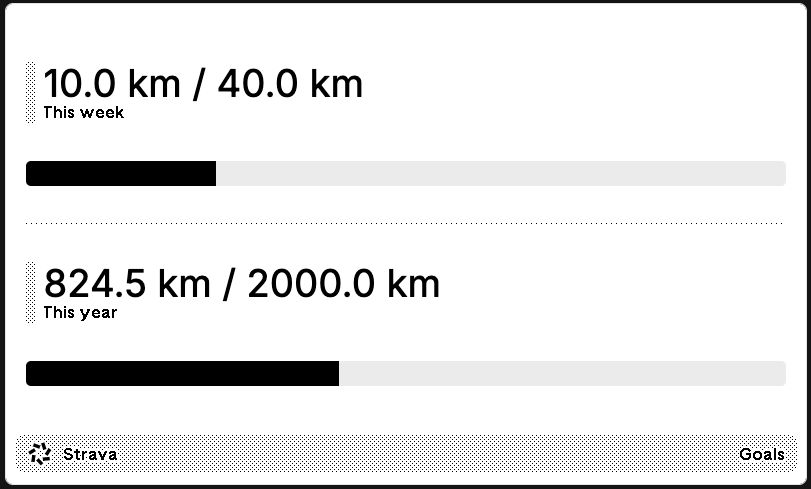

# trmnl-strava-goals

Push Strava goals to TRMNL



## Setup

1. Create a Strava API application at https://www.strava.com/settings/api
   - Set the "Authorization Callback Domain" to `localhost`

2. Create a Private Plugin on [TRMNL](https://usetrmnl.com/):
   - Go to https://usetrmnl.com/plugins
   - Create a new Private Plugin
   - Copy the UUID from the plugin settings
   - Paste `markup.html` into the markup for this plugin

3. Create a `.env` file with the following variables:
   ```
   STRAVA_CLIENT_ID=your_client_id
   STRAVA_CLIENT_SECRET=your_client_secret
   TRMNL_PLUGIN_UUID=your_trmnl_plugin_uuid
   ```

4. Update the `goals.yml` file with your weekly and yearly running goals:
   ```yaml
   weekly: 30  # kilometers
   yearly: 1500  # kilometers
   ```

5. Install dependencies:
   ```bash
   pip install -r requirements.txt
   ```

6. Run the script:
   ```bash
   python send_strava_goals_to_trmnl.py
   ```
   - The first time, you'll be prompted to authorize the application in your browser
   - When you authorize it, Strava will redirect you back to `http://localhost:8000?code=your_strava_authorization_code`
   - Copy the code and paste it into the `Enter the code from the redirect URL:` prompt in the terminal where you ran the script
   - This will save the access and refresh token in a `.strava-credentials` locally so that you don't have to authorize the app again

7. Schedule the script:

   **Locally**:
   - Use `crontab -e` to schedule the script to run every day
   - Add this line `0 0 * * * cd /path/to/trmnl-strava-goals && python send_strava_goals_to_trmnl.py`

   **GitHub Actions**:
   - Run the script locally first to generate `.strava-credentials`
   - Create an environment called `production` and add the following secrets:
      - `STRAVA_CLIENT_ID`: Your Strava Client ID
      - `STRAVA_CLIENT_SECRET`: Your Strava Client Secret
      - `STRAVA_CREDENTIALS`: The contents of your `.strava-credentials` file
      - `TRMNL_PLUGIN_UUID`: Your TRMNL plugin UUID
   - Copy the `.github/workflows/daily-strava-goals-sync.yml` file to your repo
   - The action will run daily at midnight UTC by default. You can modify the cron schedule in the workflow file to run at your preferred time

## Contributing

Contributions are welcome! Please feel free to submit a Pull Request.

## License

This project is licensed under the Apache 2.0 License - see the [LICENSE](LICENSE) file for details.
